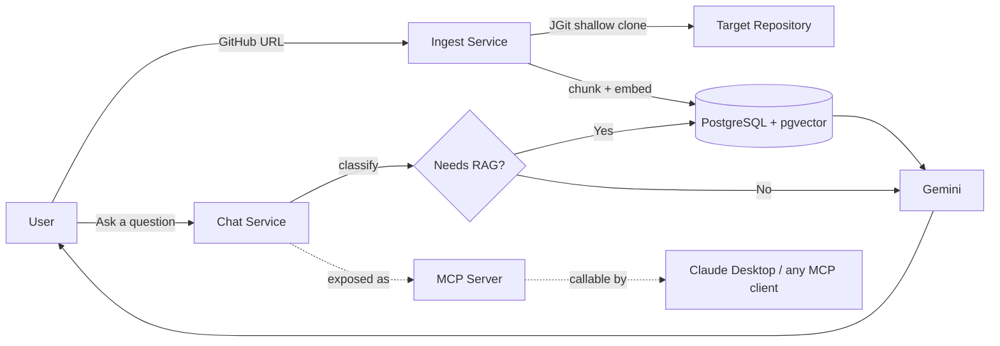

<div align="center">

# 🛡️ CodeSentry

**Chat with any public GitHub repository.**
An AI-powered codebase intelligence platform built with Spring Boot, Spring AI, and RAG — ask questions, get code reviews, and explore any codebase through a live chat interface.

[](https://codesentry-v6kv.onrender.com)
[](https://openjdk.org/)
[](https://spring.io/projects/spring-boot)
[](https://spring.io/projects/spring-ai)
[](#license)

[**🚀 Live Demo**](https://codesentry-v6kv.onrender.com) · [Frontend Repo](https://github.com/silver-bullet007/CodeSentry-Frontend) · [Report a Bug](../../issues)

</div>

---

## 🎥 What is CodeSentry?

Point CodeSentry at any public GitHub repository, and it will clone it, understand it, and let you **chat with it in plain English**. Ask "what does this codebase do?", "how is authentication handled?", or "explain the design pattern used here" — and get answers grounded in the actual source code, not a generic guess.

It's also a fully working **MCP (Model Context Protocol) server**, meaning tools like Claude Desktop can plug directly into it and use its capabilities natively.

## ✨ Features

- 🔎 **Ingest any public GitHub repo** — clones, chunks, and embeds source code into a vector store on demand
- 💬 **Chat with the codebase** — retrieval-augmented answers grounded in real code, with automatic routing between plain conversation and codebase-aware retrieval
- 🧠 **Multi-turn memory** — follow-up questions understand prior context in the same conversation
- 📋 **Structured code review** — paste a snippet and get back a severity-rated breakdown of issues and suggestions, as clean structured JSON
- 🔌 **MCP server** — every core capability is also exposed as an MCP tool, independently verified with MCP Inspector, and usable from any MCP-compatible client
- 🖥️ **React frontend** — a clean chat UI with suggested questions and pre-vetted example repositories to try instantly

## 🧱 Tech Stack

| Layer | Technology |
|---|---|
| Backend | Java 21, Spring Boot 4.1, Spring AI 2.0 |
| AI / LLM | Google Gemini (chat + embeddings), provider-agnostic via Spring AI `ChatClient` |
| Vector Store | PostgreSQL + pgvector (HNSW indexing) |
| Repo Ingestion | JGit (pure-Java, shallow cloning) |
| Protocol | MCP (Model Context Protocol) — Streamable HTTP |
| Frontend | React, Tailwind CSS |
| Infra | Docker (multi-stage build), Railway |

## 🏗️ How it works



## 🚀 Try it live

**[codesentry-v6kv.onrender.com →](https://codesentry-v6kv.onrender.com)**

1. Head to the **Ingest** tab and load one of the suggested repositories (or paste any public GitHub URL)
2. Switch to the **Chat** tab and ask a question — or click one of the suggested prompts
3. Try the **Review** tab with a code snippet for a structured AI code review

> Only public repositories are supported. One repository is loaded at a time — ingesting a new one replaces the previous.

## 🛠️ Running it locally

**Prerequisites:** JDK 21, Maven, Docker, Node.js

```bash
# 1. Start a local pgvector-enabled Postgres instance
docker run --name codesentry-pg -e POSTGRES_PASSWORD=postgres -p 5434:5432 -d pgvector/pgvector:pg16
docker exec -it codesentry-pg psql -U postgres -c "CREATE EXTENSION IF NOT EXISTS vector;"

# 2. Set your Gemini API key
export GEMINI_API_KEY=your-key-here

# 3. Run the backend
./mvnw spring-boot:run
```

Frontend (separate repository):
```bash
git clone https://github.com/silver-bullet007/CodeSentry-Frontend.git
cd CodeSentry-Frontend
npm install
npm run dev
```

## 📡 API Reference

| Endpoint | Method | Description |
|---|---|---|
| `/api/ingest?repoUrl=...` | `POST` | Clone and ingest a public GitHub repository |
| `/api/chat?message=...&conversationId=...` | `GET` | Ask a question about the currently loaded codebase |
| `/api/review` | `POST` | Submit a code snippet for structured review |

The MCP server is available over Streamable HTTP at `/mcp`, exposing `askAboutCodebase`, `reviewCode`, `listFiles`, and `readFile` as callable tools — try connecting with [MCP Inspector](https://github.com/modelcontextprotocol/inspector).

## 🗺️ Roadmap

- [ ] Support ingesting private repositories
- [ ] Support multiple concurrently-loaded repositories
- [ ] AST-aware code chunking instead of token-based splitting
- [ ] Conversation summarization for long chat sessions

## 🤝 Contributing

This is primarily a personal/portfolio project, but issues and suggestions are welcome — feel free to open an [issue](../../issues) or a pull request.

## 📄 License

MIT — see [LICENSE](LICENSE) for details.

## 👤 Author

**Lokesh**
[LinkedIn](https://www.linkedin.com/in/lokeshsun) · [GitHub](https://github.com/silver-bullet007)
